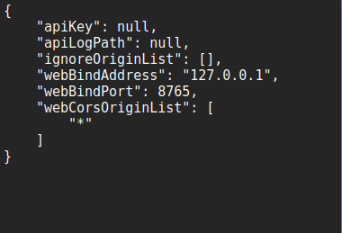

# What is it?

Inspired by [Language Reactor](https://forum.languagelearningwithnetflix.com/) and [Yomitan](https://github.com/yomidevs/yomitan), Oubl is a sentence mining tool (the process of taking words and sentences directly from your immersion and learning them with the SRS) for a language course French in Action and YouTube.

Read more about this project: [Blog link](https://medium.com/@arturbertash88/xp-driven-learning-that-feeds-the-ego-endlessly-3e6fdacafdd3)  
Read more about sentence mining: [SM basics](https://refold.la/roadmap/stage-2/a/basic-sentence-mining/)

---

## Usage

https://github.com/user-attachments/assets/9244993c-8954-4e27-949f-366939dc261a

---

### How to install?

1. Go to [Oubl Chrome Extension](https://github.com/artur-bertash/oubl-extension) and install the zip file.
2. Import it in chrome extension tab.
3. Turn on Developer Mode → Load Unpacked → Select the chrome ext dir.
4. Install [AnkiConnect](https://ankiweb.net/shared/info/2055492159) extension.
5. Replace localhost with `*` so that Oubl can talk to Anki.

   

6. Go to [Oubl](http://vercel.oubl.com/) with Anki open in the background.

Note: there is no official Anki API so it would stop working if you close the app. There is a green/red indicator top left corner that tells you if it is conencted.

https://github.com/user-attachments/assets/af21e188-1c89-412f-8e48-9c7be6382f88

---

### Architecture

- **VPS server**  
  ffmpeg for audio/video processing + yt-dlp for youtube video/subtitles downloading + [LibreTranslate](https://github.com/LibreTranslate/LibreTranslate) self-hosted for subtitles translation inside a docker

- **Chrome extension**  
  sends requests to port 8765 that lets Anki extension: [AnkiConnect](https://github.com/amikey/anki-connect) created cards.

- **Vercel back serverless**  
  DeepL API for subs/sentences translation + OpenRouter API for word in context explanation

- **Vercel front**  
  Custom events to chrome extension to talk to Anki locally

---

## To do

- Implement storing the subtitles

##P.S.
A huge thanks to [The Odin PRoject](https://github.com/theodinproject) for giving me the knowledge required to build this. 
